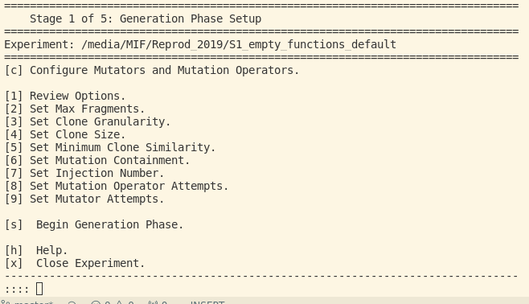

# Usage/Verwendung des MIF

Nachdem das MutationInjectionFramework(MIF/MIF-Tool) installiert wurde (siehe [Setup und Settings](../docs/MIFSetupAndSettings.md)) kann das MutationInjectionFramework aus dessen Root-Ordner (Nach der Installationsanleitung `~/MutationInjectionFramework/`) heraus mittels `./run` gestartet werden.
Das führt zum Root-Menü, in dem entweder ein Experiment geladen oder ein neues Experiment erstellt werden kann.

Das MIF-Tool durchläuft für die Evaluation eines *Clone Detectors* sechs Schritte, von Schritt 0 bis Schritt 5.
Der Schritt 0 stellt die Erstellung eines neuen Projektes dar.
Dabei werden einige allgemeine Angaben gemacht.
Bei drei der restlichen fünf Schritte (1, 3 und 5) hällt das Programm an, um weitere Informationen zum Ablauf auszugeben oder einzuholen.
Die anderen beiden Schritte (2 und 4) laufen ohne wirklichen Einfluss des Benutzers durch.

## Beschreibung der einzelnen Schritte

### S0 -- Creat New Experiment

Dieser Schritt startet, nachdem im Root-Menü der Eintrag `Create New Experiment.` ausgewählt wird. Nacheinander müssen dann die folgenden Informationen angegeben werden:
1. Typ des Experiments: Hier wird zwischen dem automatischen Erstellen von Clones und dem import manueller Clones (was nicht funktioniert) unterschieden.
2. Programmiersprache: Sprache in der die Clones und die zugehörigen Systeme geschrieben sind (Java, C, C#).
3. Pfad zum Ordner des Experiments: welcher noch nicht existieren sollte. ***Hinweis:*** Im Pfad darf kein Leerzeichen vorhanden sein!
4. Pfad zum Subject system
5. Pfad zum Source Repository

Danach wird das Experiment vorbereitet, was einige Stunden dauern kann.
Wird dieser Prozess abgebrochen, ist das Experiment _corrupted_ und daher nicht mehr verwendbar.

*Hinweis:* Alle Pfade sollten als absolute Pfade angegeben werden und keines der Teile eines Pfades sollte Leerzeichen enthalten!

### S1 -- Generation Phase

Nachdem das Experiment erstellt wurde, kann die Erzeugung der Klone begonnen werden. 
Die Anzahl an möglichen Einstellungen ist im folgenden Bild zu sehen:

Nachdem alle Einstellungen getroffen wurden, wird die Erzeugung der Klone mit `s` begonnen. 
Das kann -- in Abhängigkeit von den Einstellungen -- fast einen ganzen Tag in Anspruch nehmen.
Wird dieser Prozess abgebrochen, ist das Experiment _corrupted_ und daher nicht mehr verwendbar.

### S3 -- Evaluation Setup Stage

In diesem Schritt können _Clone Detectors_ angegeben werden, welche dann mittels der erzeugten Klone evaluiert werden. 

Es können dabei beliebig viele solcher Clone Detectors angegeben werden.
Dafür sind jeweils die folgenden Informationen notwendig:
1. Name des Clone Detectors
2. Beschreibung des Clone Detectors
3. Absoluter Pfad zum Installationsordner des Detectors
4. Absoluter Pfad zum _Tool-Runner_ des Detectors

Zudem können weitere Einstellungen für die Erkennung der Klone vorgenommen werden:
- Subsume Tolerance
- Unit Recall Required Similarity
- Unit Precision Similarity

Mit Beginn des Evaluationsprozess werden vorher erzeugten Klone an die _Clone Detectors_ übergeben und deren Resultat gespeichert. 
Wird der Prozess unterbrochen, **ist es möglich** diesen wieder aufzunehmen und fortzufühern.

### S5 -- Evaluation Results Stage

Hier können die Resultate der _Clone Detectors_ angesehen werden oder zum Schritt 3 (S3 -- Evaluation Setup Stage) zurückgekehrt werden.

## Weitere Hinweise und FAQs

#### Verwendung von Tool-Runners

Um die Kommunikation zwischen dem MIF und dem _Clone Detector_ zu organisieren wird ein _Tool-Runner_ verwendet.
Mehr Informationen dazu lassen sich in der README des MIF finden.
Hier werden noch einige zusätzliche Hinweise zum Umgang mit Tool-Runners gegeben.

#### Was ist mit `> /dev/null 2> /dev/null`?

Nachdem der ToolRunner gestartet wurde muss die nächste Ausgabe zur Kommandozeile der absolute Pfad zu den Formatierten Daten sein, welche vom MIF dann ausgewertet werden.
Deshalb wird jede mögliche andere Ausgabe in die Komandozeile in das Null-Gerät (`/dev/null`) umgeleitet.
Für mehr Infos, siehe: https://qastack.com.de/ubuntu/350208/what-does-2-dev-null-meaon

#### Wie soll die Formatierte Datei für das MIF aussehen?
In der Enddatei -- welche vom ToolRunner an das MIF zurückgegeben wird -- müssen die Clones im Format 'srcfile1,startline1,endline1,srcfile2,startline2,endline2' angegeben sein. Ein Beipsiel für die Programmiersprache Java wäre:
/Path/to/File1.java,5,10,/Path/to/File2,20,25
/Path/to/File2,20,25,/Path/to/File3,50,55

Die Dateipfade werden dabei am besten absolut angegeben.
